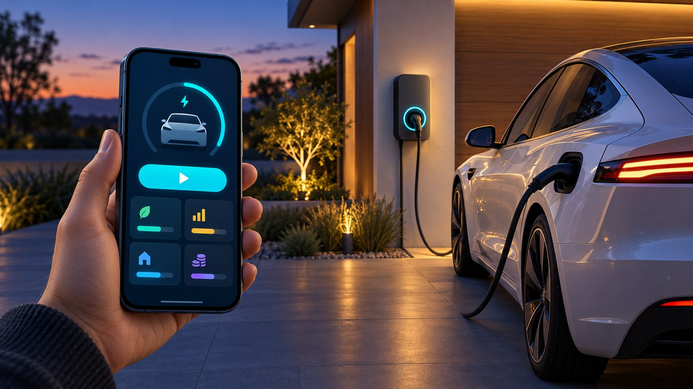
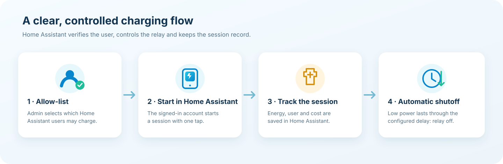

  

A simple, accountable way to share an EV charger through Home Assistant.

  
  
  
  

  

<em>Presentation illustration; the live control panel is rendered inside Home Assistant.</em>

---

## Overview

**EV Neighbor Charger** adds a dedicated Home Assistant page for starting a shared charging session, tracking energy and cost, and switching the charger off automatically after it has been idle.

Choose the relay, sensors, allowed Home Assistant users, tariff and shutoff rules in the normal integration setup form. No YAML and no separate automation are required.

## Highlights

| Feature | What it does |
| --- | --- |
| **UI setup** | Select the charger switch, power sensor, energy meter and allowed users in Home Assistant. |
| **One-tap start** | A neighbor starts charging from the integration page using their own signed-in Home Assistant account. |
| **Automatic idle shutoff** | If power stays below the configured threshold for the configured delay, the integration switches the charger off. Defaults: **100 W for 2 minutes**. |
| **Session accounting** | Records the active user, energy used and cost at the configured price per kWh. |
| **Personal history** | Neighbors see their own sessions; an administrator can review all sessions. |
| **Optional read-only access** | Selected non-admin accounts can be moved to Home Assistant's built-in Read Only group, with their previous groups saved for restoration. |
| **English and Russian** | Setup labels and descriptions are available in both languages. |

## How a charging session works

  

## Installation

### Install with HACS

1. Open **HACS → Integrations**.
2. Open the menu **⋮ → Custom repositories**.
3. Add `EvgenyKrinets/ev-neighbor-charger` and choose **Integration** as the category.
4. Download **EV Neighbor Charger**.
5. Restart Home Assistant.
6. Open **Settings → Devices & services → Add integration** and select **EV Neighbor Charger**.

### Configure the integration

Select these items in the setup form:

| Setup field | Requirement |
| --- | --- |
| Charger switch | A `switch` entity. It must be **off** when a new session starts. |
| Cumulative energy sensor | A `sensor` in **kWh** or **Wh**. |
| Current power sensor | A `sensor` in **W** or **kW**. |
| Price per kWh | Cost rate used for session totals. Default: **₪0.65/kWh**. |
| Allowed users | Home Assistant accounts permitted to start charging. |
| Restrict selected users | Optional. Moves selected non-admin users to **Read Only**. Enabled by default. |
| Idle power threshold | Power at or below which the shutoff timer starts. Default: **100 W**. |
| Shutoff delay | How long power must remain below the threshold. Default: **120 seconds**. |

The same values can later be adjusted in **Settings → Devices & services → EV Neighbor Charger → Configure**.

## Dashboard behavior

- The integration adds **EV зарядка** to the Home Assistant sidebar.
- An administrator can start a session and see the full session history.
- An allowed neighbor can start a session and sees their own energy, cost and history.
- The logged-in Home Assistant user is determined by the authenticated connection; the page does not let someone choose another user's name.
- If another session is already active, the charger is shown as busy.

## Automatic shutoff

The idle timer starts when measured power falls to or below the configured threshold. If power rises above it before the delay expires, the timer is cancelled. If power remains low for the full delay, the integration turns the switch off and closes the session.

Automatic shutoff only applies to a session started by this integration. A switch that was already on before a session starts is treated as busy, so the integration will not take ownership of an unknown charging session.

## Access and limitations

When **Restrict selected users** is enabled, selected non-admin accounts are placed in Home Assistant's built-in **Read Only** group. Their previous group memberships are saved and restored if they are removed from the allow-list or the integration is removed.

Read Only blocks direct control of entities across Home Assistant, but it does not hide other entity states or make the account a strict single-dashboard account. Home Assistant does not provide a per-user setting that limits an account to only this page.

This first version supports one charger per Home Assistant instance. Test the selected switch and sensors while present before relying on automatic shutoff.

## Current version

**v0.2.1** — fixes duplicate registration of the panel's JavaScript route after a failed setup or integration reload.

## Project links

- **Repository:** https://github.com/EvgenyKrinets/ev-neighbor-charger
- **Issues:** https://github.com/EvgenyKrinets/ev-neighbor-charger/issues
